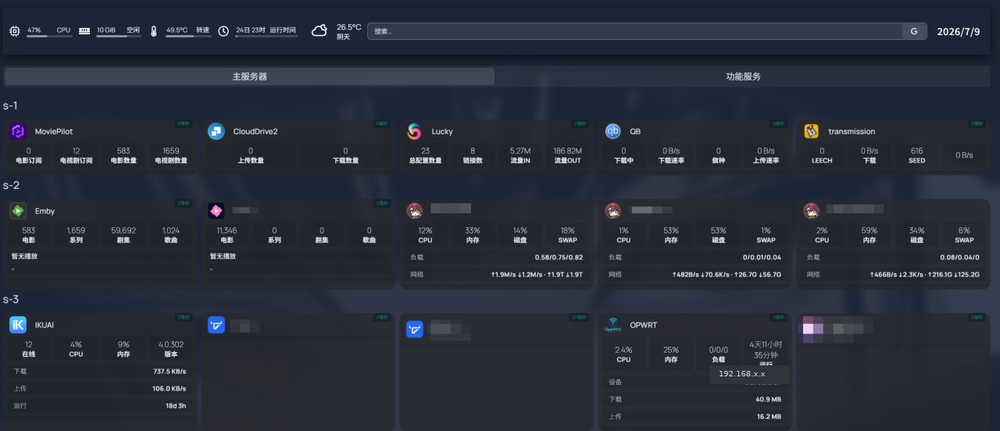

# OpenWrt HomePage

将 OpenWrt 路由监控数据转换为 Homepage `customapi` 接口。

## 依赖

- MoviePilot V2。
- 已安装并配置 `OpenWrtBackup` 插件。
- OpenWrt 已启用 LuCI `/ubus` 接口。
- 设备流量建议安装 `nlbwmon` 和 `luci-app-nlbwmon`；旧版环境也兼容 `wrtbwmon` 数据源。
- MoviePilot 能访问 OpenWrt 后台地址。
- Homepage 能访问 MoviePilot 插件 API。
- 无需额外 Python 第三方依赖。

## 依赖插件仓库地址

- `OpenWrtBackup`：https://github.com/xijin285/MoviePilot-Plugins/tree/main/plugins.v2/openwrtbackup
- `OpenWrtHomePage`：https://github.com/qqcomeup/MoviePilot-Plugins/tree/main/plugins.v2/openwrthomepage

## 工作方式

```text
OpenWrtBackup -> OpenWrtHomePage -> MoviePilot Plugin API -> Homepage customapi
```

本插件不保存 OpenWrt 用户名和密码，只读取 `OpenWrtBackup` 中已有的连接配置。

## 效果图



## API

```text
GET /api/v1/plugin/OpenWrtHomePage/summary?apikey=<MP_API_KEY>
GET /api/v1/plugin/OpenWrtHomePage/traffic?apikey=<MP_API_KEY>&limit=10
GET /api/v1/plugin/OpenWrtHomePage/services?apikey=<MP_API_KEY>
GET /api/v1/plugin/OpenWrtHomePage/homepage?apikey=<MP_API_KEY>
```

## Homepage 示例

```yaml
- OpenWrt:
    icon: openwrt.png
    href: <ROUTER_LAN_URL>
    widgets:
      - type: customapi
        url: <MP_BASE_URL>/api/v1/plugin/OpenWrtHomePage/summary?apikey=<MP_API_KEY>
        method: GET
        refreshInterval: 10000
        mappings:
          - field: cpu
            label: CPU
          - field: memory
            label: 内存
          - field: load
            label: 负载
          - field: uptime
            label: 运行
      - type: customapi
        display: list
        url: <MP_BASE_URL>/api/v1/plugin/OpenWrtHomePage/traffic?apikey=<MP_API_KEY>
        method: GET
        refreshInterval: 10000
        mappings:
          - field: top_device
            label: 设备
          - field: download
            label: 下载
          - field: upload
            label: 上传
```

完整说明见 [docs/OpenWrtHomePage.md](../../docs/OpenWrtHomePage.md)。
